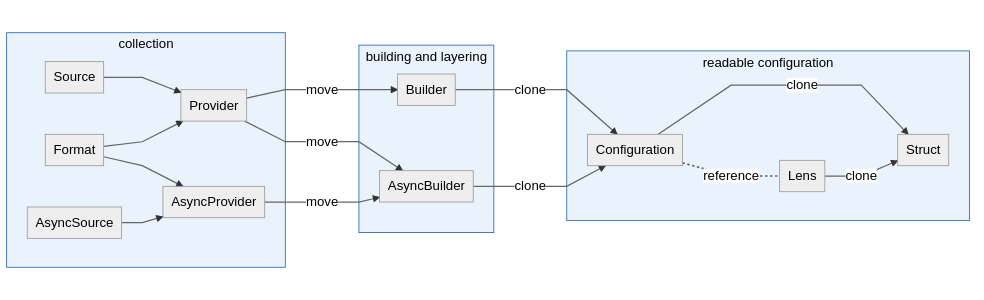

# Miau
## What

**Async aware and extensible layered configuration system for Rust**
`Miau` allows you to gather configuration from many sources, including, but not limited to:
* files
* environment
* in memory

It is built around `Serde` that does heavy lifitng part of transforming data formats into other ones. It is battle tested and perfromant.
`Miau` utilizes its capabilities to the fullest!
`Miau`'s data model allows to layer configuration trees in order of choice and convert them into Rust structs
or use as-is retrieving configuration values directy from trees on the go.
Furthermore, it allows scoping into configuration sections using dead simple DSL keeping the same capabilities.
It is built with async and extensibility in mind. Thanks to `async_trait` crate it is possible to define asynchronous configuration sources.

## How

Basic building block of the library are presented in the flowchart below.

`Sources` are, for instance, files or data from remote services. They come in two flavours - **synchronous** (blocking, no `Futures` executor is required) and **asynchronous** (non-blocking, but `Futures` executor is required).

Each source is associated with a `Format` (for instance `json` or `yaml`) that are represented by deserializers backed up by `serde`.

Together they form a `Provider` or `AsyncProvider` that is responsible for fetching and deserializing configuration to internal library structures. Some `Provider`'s are not composed of `Source` and `Format`, but are standalone structures to fetch data from sources that do not fit well into `Source` and `Format` dictinction, for instance provider responsible for fetching environment variables.

All aforementioned entities are **traits** exposed by the library. What it means for you as a user of `Miau` is that if you find some feature missing (be it format or specialized source) it is easy to plug it in the pipeline resuing rest of the components to the maximum.



Providers are lazy, which means they execute no action unless told so. This is the reponsibility of `Builder` and `AsyncBuilder` to invoke providers they **own** and properly layer resulting entities to form `Configuration`.

`Configuration` consists of ordered trees (it can be said that it is an ordered forest), one per each source, that are layered in order to provide correct overwriting behaviour for different environments of your application.

At this point you can use resulting entity to read configuration with simple DSL.

```
"key1:[index1]:key2:key3:[index2]"
```

Each time you want to specify that you want to read entry in a **map** use simple string. When you want to read particular index in the **array** use [number] (a integer surrounded by square brackets). Different keys are separated by **":"** character.

It is important to note that values retrieved from `Configuration` can not always be borrowed due to memory model used. **Therefore it is impossible to retrieve `&str` for all kind of values.** It is possible for some of them, but for easee of use reasons it is better to always retrieve `String`. Same applies for all other references.

`Configuration` can be converted into a struct of choice as long as it implements `serde`'s `Deserialize` trait and does not have any borrowed fields (effectively implementing `DeserializeOwned`).

Library provides also lensing capabilities, that is - allows you to focus on a chosen subsection of configuration and treat it as if it was top level node.

You'll find basic example underneath.

**Please keep in mind that as there are multiple structs holding configuration inside library, read access is granted by a common trait implemented by all of them - `ConfigurationRead`. It has to be in scope to have access to reading methods.**

```rust
use miau::{
    builder::ConfigurationBuilder, configuration::ConfigurationRead, format, format::Json5,
    provider::EnvironmentProvider, source::FileSource,
};
use std::collections::HashMap;
use std::env;

fn main() {
    let mut some_collection: HashMap<String, String> = HashMap::new();
    some_collection.insert("key".into(), "value".into());

    let mut builder = ConfigurationBuilder::default();

    let result = builder
        .add_provider(EnvironmentProvider::with_prefix("ASDFA")) 
        .add(
            FileSource::from_path("./files/config.json"), 
            format::json(),
        )
        .add(
            FileSource::from_path("./files/config.json5"),
            Json5::default(), 
        )
        .add_provider(some_collection)
        .build();

    let configuration = match result {
        Ok(configuration) => configuration,
        Err(e) => panic!(
            "You should handle it more gracefull in your app! {}",
            e.pretty_display()
        ),
    };

    // `get` method is defined in ConfigurationRead trait. It has to be in scope!
    let from_map_then_array: Option<i32> = configuration.get("map:[1]");
}
```


**For more examples refer to examples folder inside the source code repository to learn how to construct configuration and define your own sources.**

## Why

While writing his own applications in Rust author of this library noticed that existing libraries to create layered configuration are either unmaintained, lack support for `async` or are in other ways not extensible enough.

Goal of this library is to provide core functionality of creating layered configuration that is not likely to change often and can be extended via traits. It is not meant for `Miau` to become heavy or polutted with optional dependencies needed for specialized use cases.

That is why its only heavy dependency is `serde` and it only defines `Sources` and `Providers` that can be implemented using standard library. Only most popular formats are part of `Miau` and even they are all feature flagged. This is also why no `async` trait is implemented - there are multiple heavy executors. For the same reason no HTTP source is included - HTTP libraries are numerous.

Implementing support for aforementioned utilities should be done in separate crates (which is possible thanks to public traits).

## Feature flags

By default no feature flag is enabled.

* `ini` - activates support for Ini format
* `json` - activates support for Json format
* `msgpack` - activates support for Message Pack format
* `serde_json5` - activates support for Json5 format
* `serde_toml` - activates support for Toml format
* `yaml` - activates support for Yaml format
* `all` - activates all other feature flags

## Contributing

`Miau` will accept one-time contributions if they are of high quality, unit tested and fit well within its philosophy (laid out in `Why` and `How` sections). Willing maintainers are also welcome as author of this library believes one person cannot truly maintain open source library for a long time.

Features that were not included in first version of `Miau` but might be for some reasons useful are :
* mechanism to refresh configuration as a result of some events or periodically (however it could be better to implement it in generic way outside of this crate)

In your contributions remember to update docs and assets if necessary (with generate_assets.sh script).

## License

[MIT](./LICENSE.md)